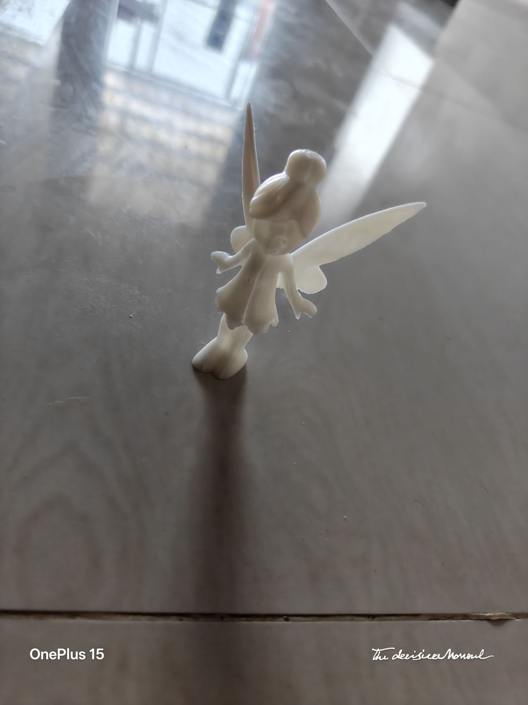
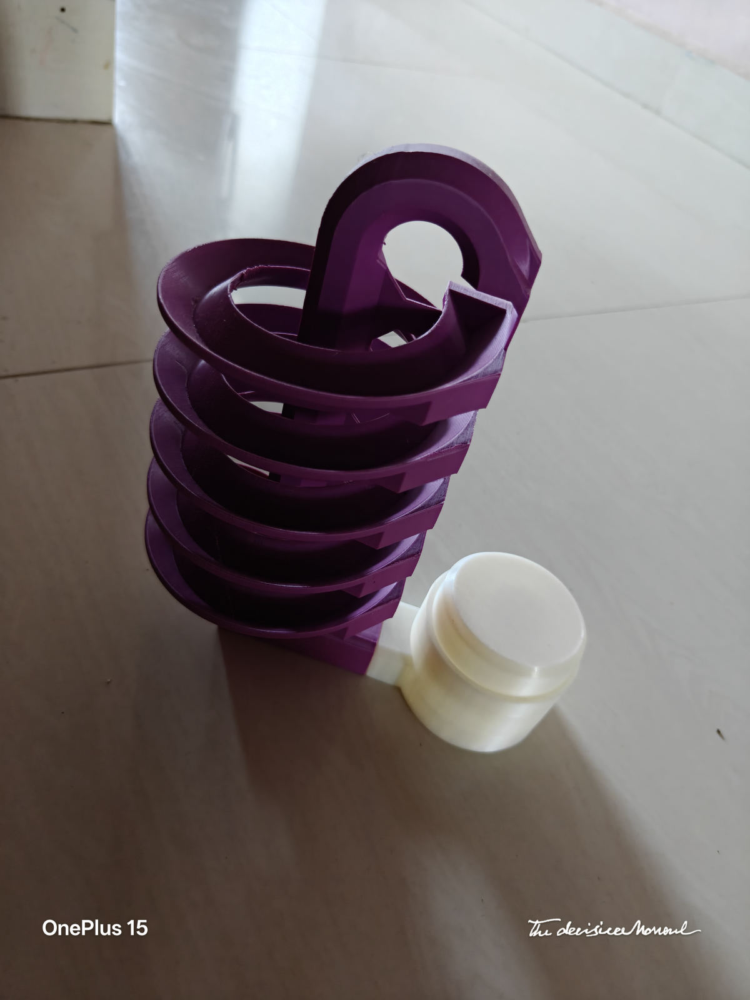
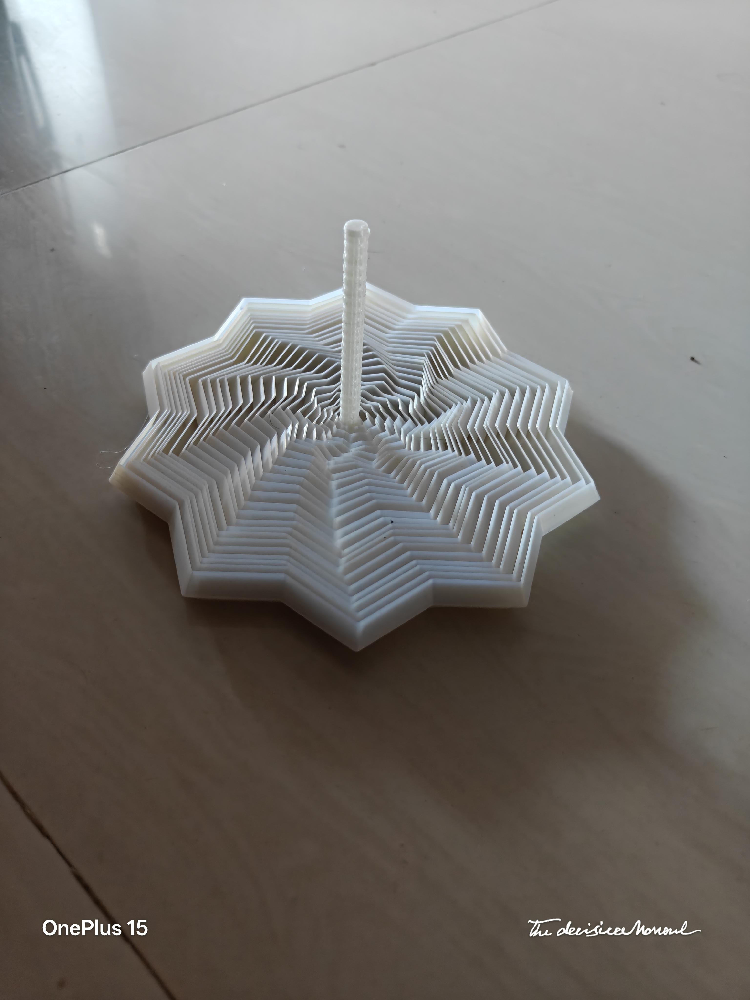
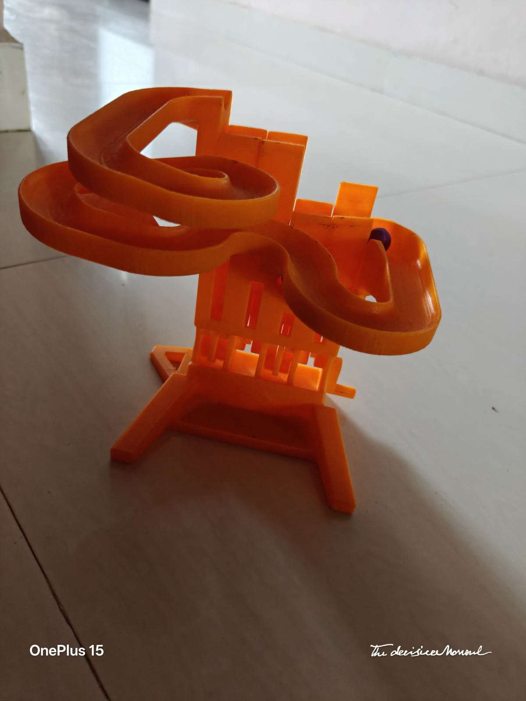

<div align="center">


<br /><br />

# 🖨️ AswinPrints

### Custom 3D Printing Services — Pondicherry, India

[](https://aswintechie.github.io/3d_printing/)
[](https://github.com/Aswintechie/3d_printing/actions)
[](https://bambulab.com)
[](#)

</div>

---

## ✨ About

**AswinPrints** is a custom 3D printing business run by [Aswin Zayasankaran](https://www.aswincloud.com), based in Pondicherry, India. Powered by the **Bambu Lab A1**, I print everything from intricate figurines and decorative pieces to functional prototypes and personalised gifts.

> 🎯 **Goal**: Make 3D printing accessible to everyone — fast turnaround, fair pricing, quality you can see.

---

## 🎨 Sample Prints

<div align="center">

| | | |
|---|---|---|
|  |  |  |
|  |  |  |

*[View full gallery →](https://aswintechie.github.io/3d_printing/#gallery)*

</div>

---

## 🛠️ Services

| Service | Description |
|---|---|
| 🎨 **Custom Figurines** | Characters, mascots, collectibles printed with fine detail |
| ⚙️ **Functional Parts** | Replacement components, brackets, mechanical parts |
| 🏠 **Home Décor** | Vases, wall art, organizers, decorative accents |
| 🎁 **Personalised Gifts** | Name plates, keychains, one-of-a-kind custom pieces |
| 🔬 **Prototypes** | Rapid prototyping for product ideas and engineering models |
| 📦 **Small Batch Runs** | Multiple copies with consistent quality |

---

## ⚙️ Tech Stack

| | Tool |
|---|---|
| **Printer** | Bambu Lab A1 |
| **Materials** | PLA · PETG · TPU |
| **Website** | Pure HTML / CSS / JS — no build tools |
| **Hosting** | GitHub Pages |
| **CI/CD** | GitHub Actions (auto-deploy on push) |

---

## 🚀 How the Site Works

The website is a static single-page app — no frameworks, no dependencies.

```
3d_printing/
├── index.html               # Main website
├── assets/
│   ├── css/style.css        # All styling
│   ├── js/main.js           # Lightbox, animations, form
│   └── images/              # 21 sample print photos
└── .github/
    └── workflows/
        └── deploy.yml       # Auto-deploy to GitHub Pages
```

Every push to `main` triggers the GitHub Actions workflow which deploys the site to:

> **https://aswintechie.github.io/3d_printing/**

---

## 📬 Get a Quote

Want something printed? Head to the [quote form](https://aswintechie.github.io/3d_printing/#quote) on the site, or reach out directly:

- 🌐 [aswincloud.com](https://www.aswincloud.com)
- 📧 aswin@aswincloud.com
- 📍 Pondicherry, India

---

## 📄 License

© 2026 Aswin Zayasankaran. All rights reserved.
